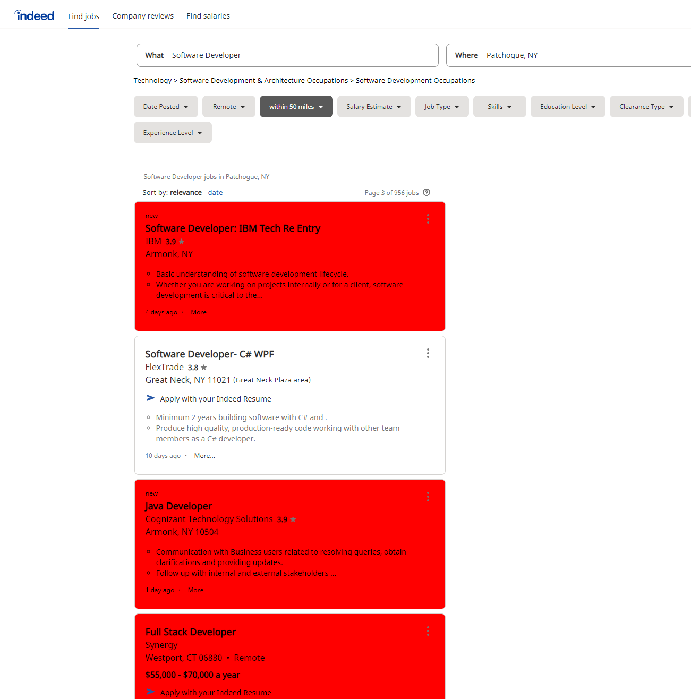

# Long Island Job Filter

Do you live on Long Island? Are you tired of searching for jobs and getting results in Connecticut or New Jersey or even in upstate New York? I know I sure am. If you answered yes to any of the questions above, then I have the script for you...

### How it works:

Any job results that are not located in Suffolk or Nassau County are marked in red, making it much easier to distinguish jobs on Long Island from jobs that aren't. See for yourself:

### How to install:

1. Download the [Tampermonkey](https://www.tampermonkey.net/) extension to your browser.
2. Click on this [link](https://github.com/dapirra/Long_Island_Job_Filter/raw/master/LIJF.user.js) to install the script.
3. Press the install button.
4. That's it!

### Supported websites:

- [Indeed](https://www.indeed.com)
- [ZipRecruiter](https://www.ziprecruiter.com)
- [Monster](https://www.monster.com)
- [Glassdoor](https://www.glassdoor.com/)

### Things to watch out for:

- Any future visual update to the layout of the supported websites could break the script for said site.
- There are 2 towns of Woodbury in New York, one in Nassau County and one in Orange county. This script can't tell one from the other and will leave any job located in Woodbury unmarked. It's up to the user to figure out which Woodbury.
